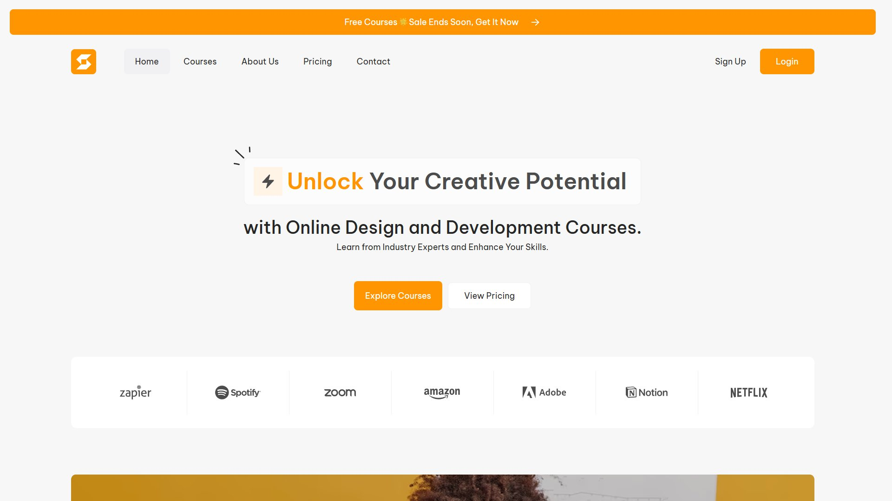
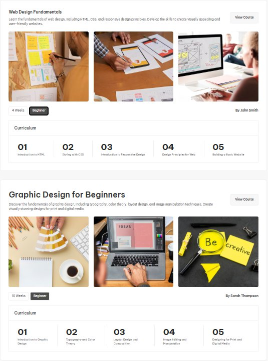
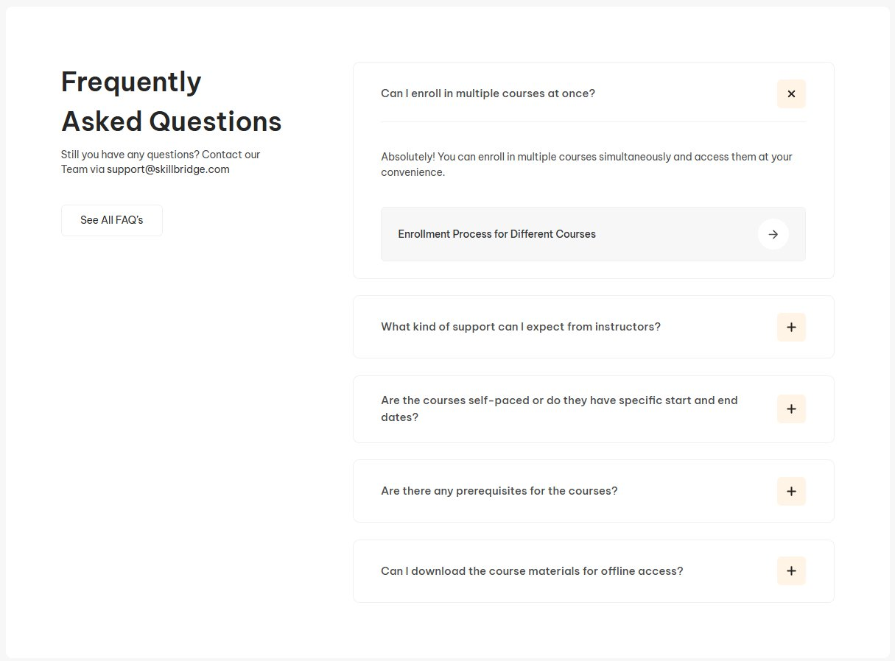
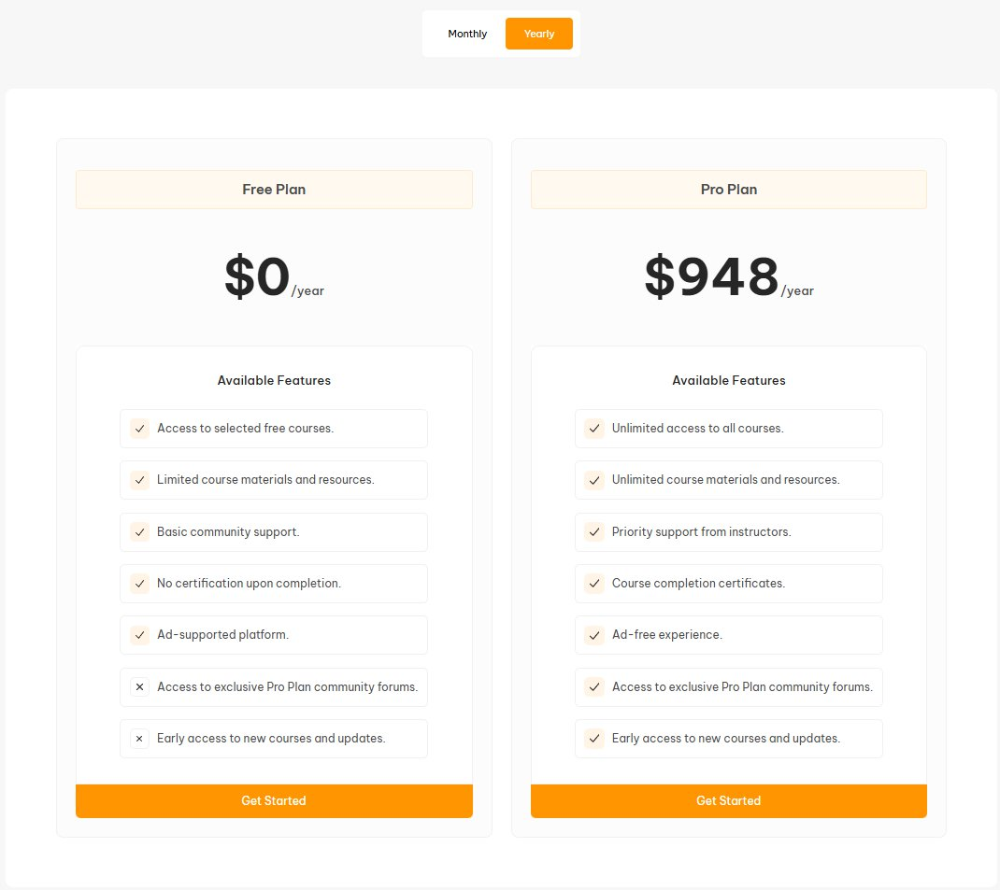

# Skillbridge

Адаптивный многостраничный сайт SkillBridge на чистом HTML, CSS и JS. Включает современный дизайн, бургер-меню и полностью адаптирован под мобильные устройства.

🔗 Живая демонстрация: https://wodocombo.com/Skillbridge/

## Стек технологий

-   HTML5
-   CSS3 (Flexbox, Grid)
-   SCSS
-   JavaScript (Vanilla JS)

## Особенности

-   Полностью адаптивная верстка
-   Многостраничная структура
-   Бургер-меню
-   Чистый HTML/CSS/JS
-   Современная UI-архитектура

## Оригинальный макет проекта

Макет figma можете скачать [тут](https://www.figma.com/community/file/1302328770970984511).

## Установка

1. Склонируйте репозиторий:
   git clone https://github.com/wodocombo/Skillbridge.git

2. Перейдите в папку проекта:
   cd Skillbridge

3. Откройте `index.html` и запустите расширение **Live Server** в VS Code.

## Скриншоты

_Главная страница_

_Динамичные карточки курсов_

_Динамичные карточки курсов 2.0_

_Аккордеон_

_Динамичные карточки цен_

## Контакты

-   Email: wodocombo@gmail.com
-   GitHub: [wodocombo](https://github.com/wodocombo)

## Лицензия

Этот проект лицензирован под MIT License. Подробнее см. файл [LICENSE](LICENSE).

---

## Спасибо за внимание! 🙏

Благодарю за то, что уделили время просмотру моего проекта.  
Если у вас есть предложения, замечания или критика — буду рад услышать их в любой форме. Ваши отзывы помогут мне стать лучше и сделать проекты еще качественнее!
